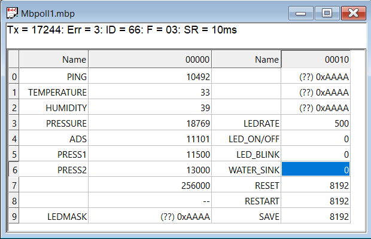

# uwb
Underwater Beacon

# Подводный маяк
Устройство для поиска ТНПА при всплытии. Отслеживает погружение и всплытие. При достижение определенного уровня давления - сигналит. Питается от аккумуляторов.

# Modbus

### Быстрый старт

Окно настройки подлключения modbus.

Результат настройки.

# Регистры Modbus

(усл.зн)* - условное значение

### Чтение

1.  `0x00`        - Счётчик. Инкрементируется каждый раз, когда читается регистр по адресу 0x00;
2.  `0x01`        - Температура - BME280;
3.  `0x02`        - Влажность - BME280;
4.  `0x03`        - Атмосферное давление - BME280;
5.  `0x04`        - Давление - MD40-10-C; (усл.зн)*
6.  `0x05`        - Хранит порог давления, после которого считается, что ТНПА погружается; (усл.зн)* (По умолчанию - 25 000)
7.  `0x06`        - Хранит порог давления, после которого считается, что ТНПА всплывает; (усл.зн)* (По умолчанию - 20 000)
8.  `0x07 - 0x08` - Текущая скорость интерфейса RS485; *(По умолчанию - 153600 Бод) (4 байта)
9.  `0x09 - 0x0C` - Шаблон мигания светодиода; *(По умолчанию - 0xAAAAAAAAAAAAAAAA) (8 байта)
10. `0x0D`        - Скорость мигания; (мс)
11. `0x0E`        - Статическое вкл/выкл светодиодов;
12. `0x0F`        - Мигание светодиодами.

### Запись

1.  `0x05`        - Хранит порог давления, после которого считается, что ТНПА погружается; (усл.зн)* (По умолчанию - 25 000)
2.  `0x06`        - Хранит порог давления, после которого считается, что ТНПА всплывает; (усл.зн)* (По умолчанию - 20 000)
3.  `0x07 - 0x08` - Текущая скорость интерфейса RS485; *(По умолчанию - 153600 Бод) (Мин: 600 Бод, Макс: 153600 Бод) (4 байта)
4.  `0x09 - 0x0C` - Шаблон мигания светодиода; *(8 байта)
5.  `0x0D`        - Скорость мигания; (мс)* (По умолчанию - 500 мс)
6.  `0x0E`        - Статическое вкл/выкл светодиодов; * (По умолчанию - 0)
7.  `0x0F`        - Мигание светодиодами; * (По умолчанию - 0) (2 байта)
8.  `0x10`        - Программный RESET, сбрасываются все регистры;
9.  `0x11`        - Переводит UWB в начальное состояние сохранения состояния всех регистров; (Для отключения мигания по причине всплытия устройства).

Примечание: 
1. Условие для записи в регистр `0x0E`: регистр `0x0F` должен быть записан 0 и не UWB не должен находиться в аварийном режиме, когда мигают светодиоды.
2. Условие для записи в регистр `0x0F`: регистр `0x0E` должен быть записан 0 и не UWB не должен находиться в аварийном режиме, когда мигают светодиоды.

# Инструкция по штатному применению

## Включние маяка

1. Подать на маяк питание от аккумуляторов
2. Убедиться, что зажглись светодиоды, то есть включилось питание 3V3, 5V0 и 6V0

## Командный режим

1. Подключить шину RS485 согласно фото ниже.

1. Запустить программу Modbus poll;
1.1 Зайти в Read/Write Definition
2. Задать Slave ID `66`;
3. Address mode: `dec`;
4. Address: `0`;
5. Quantity: `18`;
6. Scan Rate: `1000` ms.
7. Click `OK`.

8. Убедиться, что показания соответствуют картинке:

 #### Проверка команд.

Команда Включить светодиоды.
1. Выключить мигание светодиода.
2. Отправить команду Включить светодиоды. Для этого необходимо отправить значение отличное от 0 на адрес - 0x0E.
3. Убедиться, что они включились.
4. Отправить команду Выключить светодиоды. Для этого необходимо отправить значение равное 0 на адрес - 0x0E.
5. Убедиться, что они выключились.

Команда Мигать светодиодами.
1. Убедиться, что светодиод выключин.
2. Отправить команду Мигать светодиодами. Для этого необходимо отправить значение отличное от 0 на адрес - 0x0F.
3. Убедиться, что они мигают.
4. Отправить команду Мигать светодиодами. Для этого необходимо отправить значение равное 0 на адрес - 0x0F.
5. Убедиться, что они не мигают.

Команда RESET.
1. Отправить команду `RESET`. Для этого необходимо отправить значение отличное от 0 на адрес - 0x10.
2. Убедиться, что все регистры приняли значения по умолчанию.

Команда RESTART.
1. Создать давление на датчик давления и перевести UWB в аварийном режиме, после которого начнут мигать светодиоды.
2. Отправить команду `RESTART`. Для этого необходимо отправить значение отличное от 0 на адрес - 0x11.
3. Убедиться, что светодиоды не мигают.

## Аварийный режим

Для входа в аврийный режим необходимо.

1. Записать пороги двлений в реигстры: `0x05` `0x06`.
2. Задать шаблон для сигнализации: `0x09`
3. Задать длительность 1 бита шаблона: `0x0D`
4. Создать давление на датчике, которое превысит отметку хранимую в регистре по адресу - `0x05`.
5. Маяк переходит в режим погружения и следит за давлением.
6. Убедиться, что светодиод не моргает, пока приложено давление, которое не меньше давления из второго регистра по адресу - `0x06`.
7. Понизить давление, убедиться, что светодиод начал моргать, когда давление стало меньше, чем во втором регистре по адресу - `0x06`.
8. Выход из аварийного режима - команда `RESTART`.

## Режим сна

1. Из любого режима поднести к голове магнит, как показано на картинке
2. Убедиться, что потребление маяка не превышает 10мА
3. Подать питание на 24В и убедиться, что светодиоды включились, то есть включилось питание 3V3, 5V0 и 6V0
4. Проверить работоспособность целевой функции после выхода из режима сна

## Выключение маяка

1. Отсоединить от аккумуляторов
